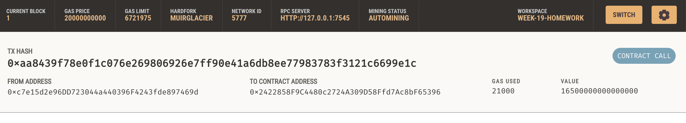

## Unit 19 Homework: Cryptocurrency Wallet

### Background

YFintech Finder is an application that its customers can use to find fintech professionals from among a list of candidates, hire them, and pay them using cryptocurrency. 

I have integrated the Ethereum blockchain network into the application in order to enable customers to instantly pay the fintech professionals whom they hire with cryptocurrency.

### How to use this application

1. On the  webpage, select a candidate that you would like to hire from the drop-down menu. Then, enter the number of hours that you would like to hire them for.

Here, I have selected Ash and hired him for 0.05 hours.

2. Navigate to the Transactions section of Ganache.

Prior to the transaction, our account has 100 ETH.

3. Click the Send Transaction button to sign and send the transaction with your Ethereum account information. 

The transaction has been validated.

Post transaction, the relevant amount has been deducted from our account.

The transaction details can also be viewed on Ganche.

4. Inspect the transaction’s To address.

